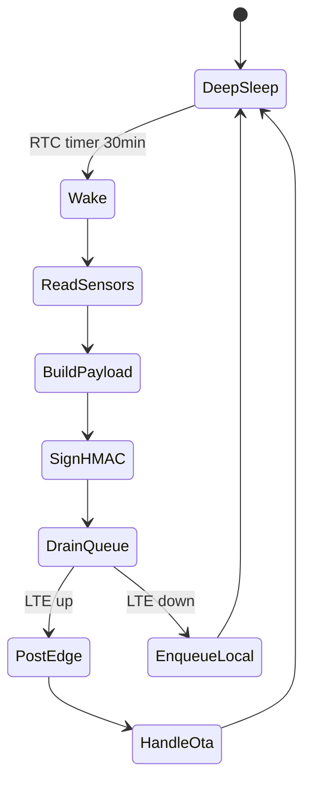

# Firmware Specification (Draft)

Eco-Sense Con Ho field node firmware for ESP32 + LTE modem.

## References

- Telemetry API: [`docs/API_CONTRACTS.md`](../../docs/API_CONTRACTS.md)
- Gateway Supabase ingest: [`GATEWAY_SUPABASE_INGEST.md`](GATEWAY_SUPABASE_INGEST.md)
- Store-and-forward queue: [`QUEUE_AND_FALLBACK.md`](QUEUE_AND_FALLBACK.md)
- PlatformIO project: [`platformio.ini`](../platformio.ini)

## Hardware target

| Component | Target |
|-----------|--------|
| MCU | ESP32 |
| Modem | A7670C or SIM7600 (LTE Cat-1) |
| EC probe | TBD — I2C/ADC interface |
| Ultrasonic | Water level sensor |
| Power | Battery + solar (TBD mAh) |

## State machine



## Wake cycle

- Interval: **30 minutes** (configurable)
- Sequence: power sensors → read → sign → upload queued + current sample → sleep
- Max upload batch: **N=5** oldest queued samples per wake (see QUEUE_AND_FALLBACK.md)

## LTE attach

- Retry backoff: 30s, 60s, 120s (max 3 attempts per wake)
- On persistent failure: enqueue locally, increment `queue_overflow_count` if full

## Time sync

- Required for HMAC replay window (±300s)
- Source: modem NITZ or NTP after LTE attach
- On clock unset: skip upload, retain in queue

## message_id generation

Recommended format: `{device_id}-{unix_seconds}-{seq}`

Example: `STATION_01-1700000000-001`

Must be unique per sample; reuse only when retrying the **same** unsent payload.

## HMAC signing

Implement per `docs/API_CONTRACTS.md`:

- Canonical pipe string (12 fields)
- HMAC-SHA256 with device secret
- Lowercase hex output

Use test vectors from contract tests before field deployment.

## OTA (future phase)

1. Parse `ota` object from ingest success response
2. If `update_available`, download `binary_url`
3. Verify SHA256 against `sha256` field
4. Flash to OTA partition (ESP32 dual-partition layout TBD)
5. Reboot and report new `firmware_version`

No OTA ack endpoint in v1 — version reported on next telemetry.

## Provisioning

- `device_id` and `device_secret` injected at manufacture (NVS partition)
- Never log secret over serial in production builds
- Production secrets must not use pilot seed values

## Build

```bash
cd firmware/esp32-node
pio run -e esp32dev
pio run -e esp32dev-test
```

## Open items

- [ ] Pin map for EC probe, ultrasonic, modem UART
- [ ] Modem AT command driver abstraction
- [ ] NVS provisioning layout
- [ ] Deep sleep power budget measurement
- [ ] Field test plan integration
